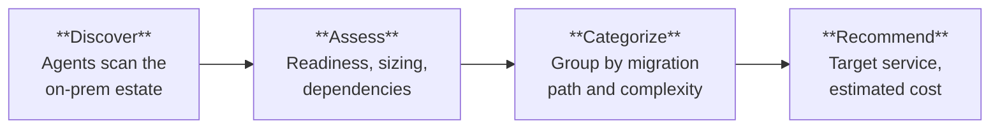

Strategy gave us direction. Now we need evidence. **Azure Migrate** provides
a comprehensive, automated assessment of the entire estate — infrastructure,
applications, and databases — so we can make informed decisions about what
moves, how it moves, and in what order.

## MCEM Stage 2 — Inspire

This is **MCEM Stage 2: Inspire**. We show the customer what is possible.
The assessment transforms abstract modernization goals into concrete,
workload-specific recommendations backed by data.

## Three Dimensions of Assessment

Azure Migrate assesses the estate across three dimensions simultaneously.
Each dimension produces its own set of findings and recommendations.

### Infrastructure

- How many VMs are running, and what are their actual utilization patterns?
- Which VMs are right-sized, which are oversized, which are idle?
- What operating system versions are in use — and are any end-of-support?
- What are the network dependencies between servers?

### Applications

- What .NET Framework versions are the applications built on?
- Which applications are IIS-hosted web apps vs. Windows services?
- What are the application-to-database dependencies?
- How complex would it be to modernize each application?

### Databases

- What SQL Server versions and editions are running?
- What features are in use (CLR, linked servers, Service Broker)?
- What is the database size and performance profile?
- What is the compatibility level with Azure SQL targets?

## What the Assessment Reveals

A typical assessment for an organization with a traditional .NET and SQL Server
estate reveals a distribution something like this:

| Category                    | Typical Finding                             |
| --------------------------- | ------------------------------------------- |
| **Ready to migrate as-is**  | 60-70% of VMs can move with minimal changes |
| **Needs minor remediation** | 15-20% require OS updates or config changes |
| **Needs modernization**     | 10-15% would benefit from re-architecture   |
| **Retire or consolidate**   | 5-10% are unused, redundant, or end-of-life |

:::tip[The assessment is not just a migration tool]
Many customers discover workloads they did not know they had — shadow IT,
forgotten test environments, or services that nobody owns. The assessment
is often the first time an organization has a complete, accurate inventory
of its own estate.
:::

## From Assessment to Horizons

The assessment data feeds directly into the next phase: designing a
**Horizons-based roadmap** that matches each workload to the right
modernization path — whether that is a quick lift-and-shift (Horizon 1)
or a deeper cloud-native transformation (Horizon 2).
