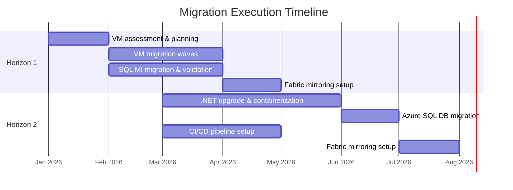
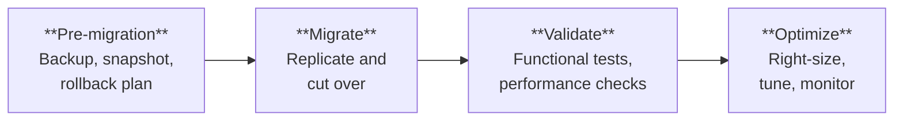

The roadmap is approved. The workloads are assigned to horizons. Now we
execute — methodically, with guardrails, and with continuous validation
at every step.

## MCEM Stage 4 — Empower

This is **MCEM Stage 4: Empower**. The customer team is enabled to deliver
the migration with Microsoft support, tooling, and best practices. The
goal is not just to move workloads — it is to build the customer's
capability to operate and evolve their Azure environment independently.

## Execution by Horizon

### Horizon 1 — Execution Steps

1. **Prepare landing zone** — Azure Virtual Network, NSGs, Azure Backup
   vaults, monitoring baselines
2. **Migrate VMs in waves** — Use Azure Migrate to replicate and cut over
   VMs in planned waves, starting with low-risk workloads
3. **Migrate databases** — Use Azure Database Migration Service (DMS) for
   online migration to SQL Managed Instance with minimal downtime
4. **Validate and optimize** — Run functional tests, validate performance,
   right-size VMs based on actual Azure utilization data
5. **Enable Fabric mirroring** — Configure SQL MI Mirroring to OneLake
   for workloads where analytics is a strategic priority

### Horizon 2 — Execution Steps

1. **Upgrade .NET applications** — Use the .NET Upgrade Assistant to migrate
   from .NET Framework to .NET 8+, resolve breaking changes
2. **Containerize** — Create Dockerfiles, set up Azure Container Registry,
   configure Azure Container Apps environments
3. **Set up CI/CD** — Build GitHub Actions or Azure DevOps pipelines for
   automated build, test, and deployment
4. **Migrate databases** — Move to Azure SQL Database, adjust connection
   strings, validate query performance
5. **Enable Fabric mirroring** — Configure Azure SQL DB mirroring to OneLake

## Migration Guardrails

Every migration wave follows the same validation pattern:

:::caution[Never skip validation]
Every workload gets a validation checkpoint after migration. Functional
testing, performance benchmarking, and user acceptance — all before the
on-premises source is decommissioned. Rollback plans remain active until
validation is complete.
:::

## Building Customer Capability

Execution is also a learning opportunity. Throughout the migration, the
customer team builds skills in:

- Azure networking and security fundamentals
- Infrastructure-as-code (Bicep or Terraform)
- Container operations and CI/CD pipelines
- Fabric administration and analytics development
- Cost management and optimization practices

By the time the migration is complete, the customer does not just have
workloads in Azure — they have a team that knows how to operate them.
