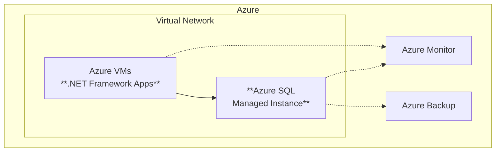

Horizon 1 is about getting to Azure quickly and safely. The applications
do not change. The databases stay compatible. But the infrastructure
underneath becomes modern, managed, and cost-optimized.

## What Moves

| On-Premises           | Azure Target                 | Migration Tool                   |
| --------------------- | ---------------------------- | -------------------------------- |
| Windows Server VMs    | Azure Virtual Machines       | Azure Migrate                    |
| SQL Server databases  | Azure SQL Managed Instance   | Azure Database Migration Service |
| Network configuration | Azure Virtual Network + NSGs | Azure Migrate                    |

## The Architecture

## Why SQL Managed Instance

SQL Managed Instance is the key to Horizon 1. It provides near-100%
compatibility with on-premises SQL Server — which means databases move
without application code changes.

**What you keep:**

- SQL Agent jobs
- Cross-database queries
- CLR assemblies
- Linked servers (within the managed instance)
- Database mail

**What you gain:**

- Automated patching and backups
- Built-in high availability
- Transparent data encryption by default
- Elastic scaling without downtime
- Pay-per-use instead of upfront licensing

## Quick Wins

Horizon 1 delivers measurable value within weeks:

- **Right-sizing**: VMs are provisioned to match actual utilization,
  not peak-plus-headroom estimates from five years ago
- **Reserved instances**: Commit to 1-year or 3-year terms for
  significant cost savings on predictable workloads
- **Automated operations**: Patching, backups, and monitoring move
  from manual processes to managed services
- **Decommission on-premises**: Reduce data center footprint and
  associated facilities costs

:::tip[H1 is not a compromise]
Lift and shift is sometimes dismissed as "just moving the problem to the
cloud." But when done right — with proper right-sizing, reserved instances,
and managed database services — H1 delivers immediate, measurable business
value while buying time for deeper modernization where it matters most.
:::

## What Comes Next

Once workloads are running in Azure, you have two paths:

1. **Stay in H1** — For stable, low-change workloads, this is the right answer.
   Add [Fabric integration via SQL MI Mirroring](/dc2fabric/horizons/h1-fabric/)
   to unlock analytics without any further changes.
2. **Evolve to H2** — For workloads that need elasticity, modern DevOps, or
   cloud-native capabilities, plan a [Horizon 2 modernization](/dc2fabric/horizons/h2-modernize/).
