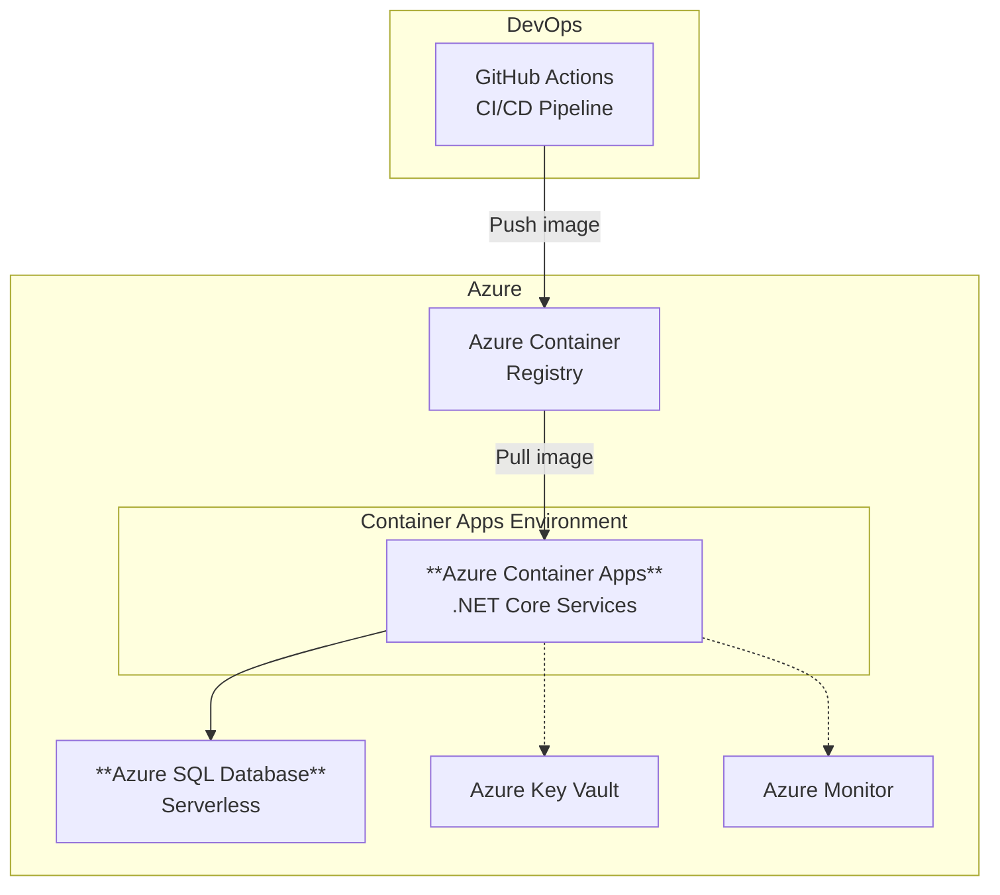

Horizon 2 is a deeper transformation. Applications are re-architected for
the cloud. Databases move to fully managed PaaS services. The result is a
modern, elastic, DevOps-ready platform that can evolve as fast as the
business needs it to.

## What Changes

| On-Premises / H1          | Horizon 2 Target                            | Benefit                                 |
| ------------------------- | ------------------------------------------- | --------------------------------------- |
| .NET Framework on IIS/VMs | **.NET (Core) on Azure Container Apps**     | Elastic scale, portable, CI/CD-ready    |
| SQL Server / SQL MI       | **Azure SQL Database**                      | Serverless scale, built-in intelligence |
| Manual deployment         | **GitHub Actions / Azure DevOps pipelines** | Automated, repeatable, auditable        |
| Monolithic architecture   | **Container-based services**                | Independent scaling and deployment      |

## The Architecture

## The .NET Modernization Path

Moving from .NET Framework to modern .NET is the core application change
in Horizon 2. The approach depends on the application's complexity:

1. **Upgrade in place** — For well-structured applications, use the
   .NET Upgrade Assistant to migrate from .NET Framework to .NET 8+
2. **Strangler fig pattern** — For large monoliths, extract services
   incrementally while the legacy application continues to run
3. **Rewrite critical paths** — For deeply coupled code, rewrite the
   highest-value components as modern services

The containerized application runs on **Azure Container Apps** — a
serverless container platform that handles scaling, load balancing,
and ingress without managing Kubernetes directly.

## Why Azure SQL Database

Azure SQL Database is a different service from SQL Managed Instance.
Where SQL MI maximizes compatibility with on-premises SQL Server,
Azure SQL Database is designed for cloud-native workloads:

- **Serverless compute** — Scales to zero during idle periods, scales
  up automatically under load
- **Built-in intelligence** — Automatic tuning, threat detection,
  and performance recommendations
- **Elastic pools** — Share resources across multiple databases for
  cost efficiency
- **Hyperscale tier** — Scale to 100 TB+ with near-instant backups

:::tip[Not every workload needs H2]
Horizon 2 delivers the most value for workloads that are actively
developed, customer-facing, or need to scale dynamically. For stable,
internal workloads, Horizon 1 with SQL Managed Instance is often the
better fit — and the smarter investment.
:::

## What Comes Next

With a containerized application and Azure SQL Database, you are
ready to add [Fabric integration via Azure SQL DB mirroring](/dc2fabric/horizons/h2-fabric/)
for a fully unified, AI-ready data platform.
