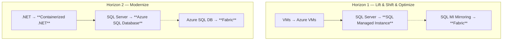
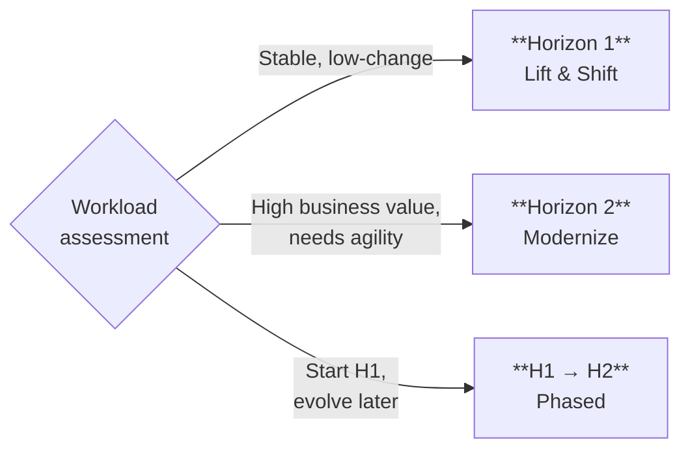

:::tip[TL;DR]
Not every workload needs the same treatment. Horizon 1 (Lift & Shift) gets
workloads to Azure in weeks with minimal risk. Horizon 2 (Modernize) re-architects
for cloud-native agility over months. Strategy decides which path each workload takes.
:::

The assessment gave us the evidence. Now we design the roadmap.
**Not every workload needs the same treatment.** The Horizons model
provides a structured way to match each workload to the right level of
modernization — based on business strategy, not technical ambition.

## MCEM Stage 2 — Inspire and Design (continued)

Horizons design is the second half of **MCEM Stage 2: Inspire and Design**.
We take the assessment findings, overlay the customer's strategic priorities,
and produce a concrete plan that balances quick wins with long-term
transformation.

## Two Horizons

### Horizon 1 — Lift & Shift & Optimize

Move workloads to Azure with minimal application changes.
VMs migrate to Azure VMs. SQL Server databases migrate to
**Azure SQL Managed Instance** — a fully managed service that
provides near-100% compatibility with on-premises SQL Server.

**Why choose H1?**

- Fast time to value — weeks, not months
- Minimal application risk — the code does not change
- Immediate infrastructure cost savings (right-sizing, reserved instances)
- If aligned with strategy: enable **SQL MI Mirroring to Fabric**
  for near-real-time analytics without re-architecting anything

### Horizon 2 — Modernize

Re-architect applications for cloud-native benefits.
.NET Framework applications are upgraded to .NET (Core) and
containerized. Databases migrate to **Azure SQL Database** —
a cloud-native PaaS service with elastic scale, built-in HA,
and advanced security.

**Why choose H2?**

- Elastic scale — handle traffic spikes without over-provisioning
- CI/CD and DevOps-ready — containers enable modern deployment pipelines
- Lower long-term TCO — PaaS services reduce operational overhead
- If aligned with strategy: enable **Azure SQL DB in Fabric**
  for a unified, AI-ready data platform

## Sequential, Parallel, or Both

The Horizons model is not a rigid sequence. Strategy decides
which pattern fits:

- **Some workloads stay H1 forever** — they are stable, well-understood,
  and the business does not need them to change
- **Some workloads go directly to H2** — they are high-priority,
  customer-facing, or need capabilities that only cloud-native provides
- **Some workloads start H1 and evolve to H2** — get them to Azure quickly,
  then modernize when the team is ready

:::note[Strategy decides, not technology]
The worst modernization programs try to modernize everything at once.
The best ones let the business strategy determine the right horizon
for each workload — and accept that not everything needs to be cloud-native.
:::

## Deep Dives

Explore each horizon and its Fabric integration in detail:

- [Horizon 1 — Lift & Shift & Optimize](/dc2fabric/horizons/h1-lift-shift/)
- [Horizon 1 + Fabric](/dc2fabric/horizons/h1-fabric/)
- [Horizon 2 — Modernize](/dc2fabric/horizons/h2-modernize/)
- [Horizon 2 + Fabric](/dc2fabric/horizons/h2-fabric/)

[← Back to Assessment](/dc2fabric/assessment/) · [Skip to Execution →](/dc2fabric/execution/)
