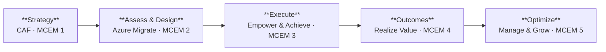

import { CardGrid, Card, LinkCard } from "@astrojs/starlight/components";

## The Journey at a Glance

## By the Numbers

<CardGrid>
  <Card title="2 Horizons" icon="list-format">
    **H1** — Lift & Shift in weeks. **H2** — Modernize over months. Strategy
    decides which path each workload takes.
  </Card>
  <Card title="Typical 30–60% Savings" icon="approve-check-circle">
    Right-sizing, reserved instances, and PaaS services deliver measurable
    savings. Use the [Azure TCO Calculator](https://azure.microsoft.com/pricing/tco/calculator/) for your estimate.
  </Card>
  <Card title="Zero-ETL Analytics" icon="rocket">
    SQL MI and Azure SQL DB mirror data to Fabric in near-real-time — no
    pipelines to build or maintain.
  </Card>
  <Card title="5 MCEM Stages" icon="open-book">
    Listen & Consult → Inspire & Design → Empower & Achieve → Realize Value
    → Manage & Optimize. A proven engagement methodology.
  </Card>
</CardGrid>

## What You Will Learn

<CardGrid>
  <LinkCard
    title="Strategy First"
    description="Align modernization to business outcomes using CAF and MCEM Stage 1."
    href="/dc2fabric/strategy/"
  />
  <LinkCard
    title="Assess Everything"
    description="Azure Migrate scans VMs, apps, and databases for evidence-based decisions."
    href="/dc2fabric/assessment/"
  />
  <LinkCard
    title="The Horizons Model"
    description="Match each workload to the right level of modernization."
    href="/dc2fabric/horizons/"
  />
  <LinkCard
    title="Execution & Guardrails"
    description="Migrate in waves with validation checkpoints at every step."
    href="/dc2fabric/execution/"
  />
  <LinkCard
    title="Fabric as the Unifier"
    description="All data converges in OneLake — one analytics platform, not two."
    href="/dc2fabric/outcomes/"
  />
  <LinkCard
    title="Full Journey Map"
    description="The complete MCEM journey with stage-by-stage breakdown and Gantt timeline."
    href="/dc2fabric/journey-map/"
  />
</CardGrid>

## Three Industries, One Journey

Every organization's path from datacenter to cloud is unique — but the
pattern is universal. Explore how three different industries navigate
the same modernization journey.

<CardGrid>
  <Card title="Manufacturing" icon="setting">
    **Contoso Industries** — 127 VMs, real-time supply chain visibility,
    predictive maintenance via Fabric. [Read the story
    →](/dc2fabric/industries/manufacturing/)
  </Card>
  <Card title="Financial Services" icon="approve-check-circle">
    **Woodgrove Bank** — 340 VMs, regulatory compliance, real-time fraud
    detection via Fabric. [Read the story
    →](/dc2fabric/industries/financial-services/)
  </Card>
  <Card title="Retail" icon="open-book">
    **Northwind Traders** — 65 VMs, seasonal autoscaling, Customer 360 view via
    Fabric. [Read the story →](/dc2fabric/industries/retail/)
  </Card>
</CardGrid>

:::note[For Microsoft Partners]
Delivering this journey to your customers? The
[Partner Guide](/dc2fabric/industries/partner-guide/) has conversation
starters, objection handling, and industry quick-reference cards.
:::
