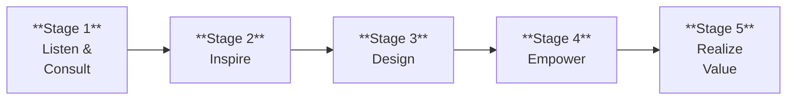
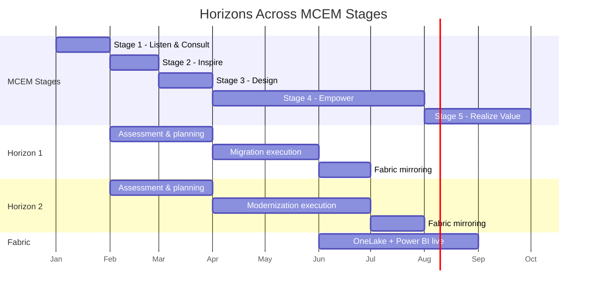

This page maps the entire dc2fabric journey across the five stages of the
Microsoft Customer Engagement Methodology (MCEM). Each stage builds on
the previous one, with clear activities, outcomes, and decision points.

## The Full Journey

## Stage-by-Stage Breakdown

### Stage 1 — Listen and Consult

**Focus:** Understand the customer's business, not their technology.

| Activity                                             | Outcome                                     |
| ---------------------------------------------------- | ------------------------------------------- |
| Discovery conversations with business and IT leaders | Shared understanding of business pressures  |
| Cloud Adoption Framework — Strategy phase            | Documented motivations and desired outcomes |
| Cloud Adoption Framework — Plan phase                | Prioritized workload list                   |
| Stakeholder alignment workshops                      | Executive sponsorship and shared vision     |

**Decision gate:** Does cloud modernization align with the customer's
strategic priorities? If yes, proceed to assessment.

### Stage 2 — Inspire

**Focus:** Show what is possible with evidence, not promises.

| Activity                               | Outcome                                        |
| -------------------------------------- | ---------------------------------------------- |
| Azure Migrate discovery and assessment | Complete inventory of VMs, apps, databases     |
| Infrastructure readiness analysis      | Migration readiness scores per workload        |
| Application compatibility analysis     | .NET version map and modernization complexity  |
| Database compatibility analysis        | SQL feature usage and Azure SQL target mapping |

**Decision gate:** Does the assessment confirm that the estate is suitable
for migration? Are the expected benefits realistic?

### Stage 3 — Design

**Focus:** Match each workload to the right modernization horizon.

| Activity                         | Outcome                        |
| -------------------------------- | ------------------------------ |
| Horizons classification workshop | Workloads assigned to H1 or H2 |
| Architecture design per horizon  | Target architecture diagrams   |
| Fabric integration planning      | Data mirroring strategy        |
| Migration wave planning          | Phased execution roadmap       |

**Decision gate:** Is the roadmap approved by the customer?
Are resources allocated for execution?

### Stage 4 — Empower

**Focus:** Execute the migration and build customer capability.

| Activity                                 | Outcome                             |
| ---------------------------------------- | ----------------------------------- |
| H1: VM migration waves via Azure Migrate | Workloads running on Azure VMs      |
| H1: SQL MI migration via DMS             | Databases on SQL Managed Instance   |
| H2: .NET upgrade and containerization    | Apps on Azure Container Apps        |
| H2: Azure SQL DB migration               | Databases on Azure SQL Database     |
| Fabric mirroring configuration           | Operational data flowing to OneLake |

**Decision gate:** Are all workloads validated and performing as expected
in Azure? Is the on-premises environment ready for decommission?

### Stage 5 — Realize Value

**Focus:** Measure outcomes against the original business strategy.

| Activity                          | Outcome                                        |
| --------------------------------- | ---------------------------------------------- |
| Cost optimization review          | Validated TCO reduction                        |
| Operational efficiency assessment | Reduced manual effort, faster deployments      |
| Analytics platform review         | Fabric dashboards delivering business insights |
| Skills assessment                 | Customer team operating independently          |
| Continuous improvement planning   | Roadmap for ongoing modernization              |

## Horizons Across MCEM

The following shows when each horizon activates across the MCEM stages:

:::note[Every organization's timeline is different]
The Gantt chart above is illustrative. A small estate might complete in
3 months. A large enterprise might take 12-18 months. The structure is
the same — the timeline scales with the estate size and complexity.
:::
