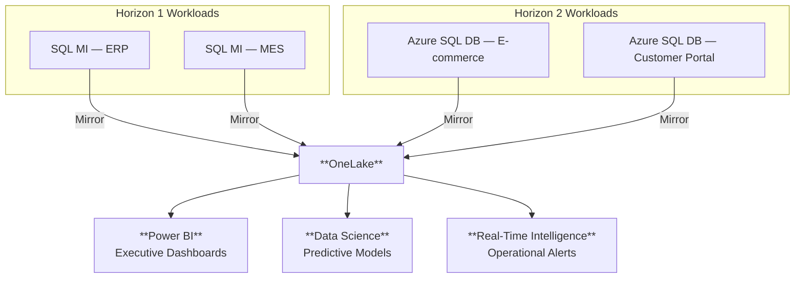

The workloads are migrated. The analytics platform is live. Now we
measure the outcomes against the business strategy we defined at the
very beginning — and demonstrate that modernization delivered real,
measurable value.

## MCEM Stage 5 — Realize Value

This is **MCEM Stage 5: Realize Value**. The customer sees the results
of their investment — not in technical metrics, but in business outcomes
that matter to their leadership team.

## Outcomes by Horizon

| Outcome                    | Horizon 1                                                    | Horizon 2                                             |
| -------------------------- | ------------------------------------------------------------ | ----------------------------------------------------- |
| **Infrastructure cost**    | 30-40% reduction through right-sizing and reserved instances | 40-60% reduction through PaaS and serverless          |
| **Operational overhead**   | Managed patching, backups, and HA replace manual processes   | Fully managed platform — no infrastructure to operate |
| **Time to deploy changes** | Days (same as before, but on better infrastructure)          | Minutes (CI/CD pipelines with automated testing)      |
| **Scale capability**       | Vertical scaling within VM SKU families                      | Elastic horizontal scaling, scale-to-zero             |
| **Analytics latency**      | Near-real-time via SQL MI Mirroring                          | Near-real-time via Azure SQL DB Mirroring             |

## Fabric as the Unifier

Regardless of which horizon each workload followed, all data converges
in Microsoft Fabric. This is the strategic payoff of the entire journey:

:::tip[One platform, not two]
The customer does not need to build separate analytics solutions for H1
and H2 workloads. Fabric unifies everything in OneLake. As workloads
evolve from H1 to H2, the data gets richer — but the analytics platform
is already in place and serving value from day one.
:::

## The Journey Does Not End

Modernization is a journey, not a big bang. After the initial migration:

- **H1 workloads** continue to deliver value and can evolve to H2 when
  the business case justifies it
- **H2 workloads** continue to modernize — adopting new Azure services,
  improving resilience, expanding capabilities
- **Fabric** grows with the business — new data sources, new analytics
  use cases, new AI models
- **The team** continues to develop cloud skills and operational maturity

The Horizons model ensures that every step forward delivers measurable
value — and that no step requires a disruptive, high-risk transformation.

**Modernization is a journey, not a big bang.**
