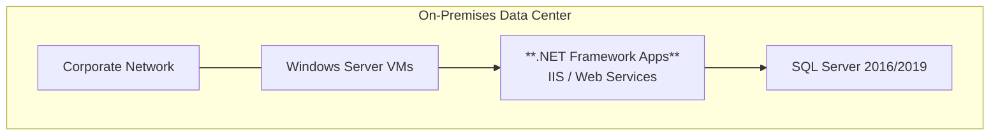

Every modernization journey starts with a question that has nothing to do with
technology: **What does your business need to achieve?**

Before a single workload moves to the cloud, we sit down with the customer and
listen. This is the foundation of everything that follows.

## The Starting Point

Most organizations we work with share a familiar picture. Years of investment
have built a stable on-premises estate — Windows Server VMs running business-critical
.NET applications, SQL Server databases holding decades of operational data, and
an IT team that keeps it all running through deep institutional knowledge.

It works. But the business is outgrowing it.

:::tip[The pattern is universal]
Whether it is a manufacturer struggling with supply chain visibility,
a bank facing regulatory pressure, or a retailer whose e-commerce platform
cannot scale for peak season — the trigger is always a business need, not
a technology refresh cycle.
:::

## Cloud Adoption Framework — Strategy and Plan

The Microsoft Cloud Adoption Framework (CAF) provides a structured approach to
this conversation. In the **Strategy phase**, we help the customer articulate:

- **Motivations** — Why now? What business event or pressure is driving change?
- **Business outcomes** — What measurable results does success look like?
- **Business justification** — Does the investment case hold up?
- **Prioritization** — Which workloads matter most to the business?

In the **Plan phase**, we map the current estate to those outcomes:

- Which applications support the highest-value business processes?
- What dependencies exist between workloads?
- What skills does the team have — and what skills will they need?

## MCEM Stage 1 — Listen and Consult

This aligns directly with **MCEM Stage 1: Listen and Consult**. The goal is not
to sell a migration project. The goal is to deeply understand the customer's
business context, validate that cloud modernization is the right path, and begin
shaping a vision that the customer owns.

Key activities in this stage:

1. **Discovery conversations** — Understand the business, not just the IT estate
2. **Stakeholder alignment** — Ensure business and IT leaders share the same vision
3. **Initial scoping** — Identify the workload categories that matter most
4. **Success criteria** — Define what "done well" looks like in business terms

:::note[Strategy first — technology follows]
The most common mistake in modernization programs is leading with technology.
"We should move to Kubernetes" or "We need to be cloud-native" are implementation
decisions, not strategies. The strategy is the business outcome. The technology
is how we get there.
:::

## What Comes Next

With a clear strategy in hand, we move to **Assessment** — using Azure Migrate to
build a complete, evidence-based picture of the current estate and identify the
best path forward for every workload.
